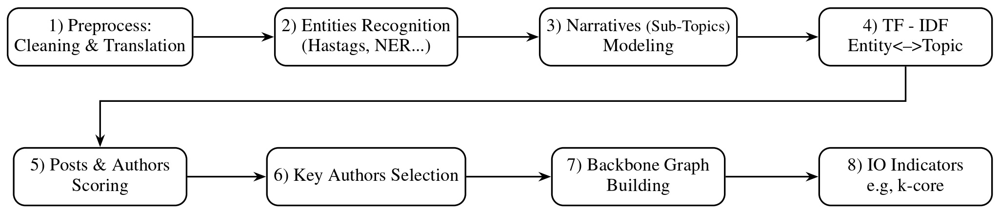

# Backbone-Graph

A research framework for building **key author graphs** from social media data and posts, used for **discourse analysis** and **Information Operation (IO) detection**.

The pipeline takes a dataset of social media posts, cleans, translates to English, clusters posts into topics, identifies the most influential entities (hashtags, urls, account mention, NER) using **TF_IDF**, identifies influential accounts per topic, and outputs a **backbone graph** where:
- **Nodes** are authors (social media accounts)
- **Edges** represent behavioral similarity, based on co-actions (e.g. same hashtag usage, repos) usage patterns scored with **TF-IDF**

The pipeline is based on `pandas` and `NetworkX` and exported the data as parquet file and the graph as GEXF.

---

## Workflow



---

## Working Directory

**Important:** Always run notebooks with `Backbone-Graph/src/` as the working directory. All paths in the notebooks assume this location.

---

## Key Terms

| Term | Definition |
|---|---|
| **IO (Information Operation)** | A collection of publications by coordinated actors pursuing a shared intent while misleading others. |
| **IO Driver** | An account that promotes one or more IO.
| **Key Author** | An account that is a leading participant in one or more narrative topics |
| **Backbone Graph** | A graph of where *nodes* represent key authors and *edges* represent behavioral similarity. |

---

## Folder Structure

```
Backbone-Graph/
├── config/                                    # Environment and job configuration
│   ├── conda_requirements.yml                 # Conda environment specification
│   ├── run_translate_topics_entities.sbatch   # SLURM job: Step 1 (preprocessing + clustering)
│   ├── run_big_data_clustering.sbatch         # SLURM job: Step 1b (large-scale clustering)
│   ├── slurm_commends.md                      # Common SLURM command
│
├── data/                                      # Input datasets
│   └── Labeled_Datasets/                      # Labeled Datasets for IO (Parquet format)
|       └── Ecuador/                           # Ecuador Campaign
│
├── docs/                                      # Design documentation, meeting notes, figures
│
├── src/                                       # All notebooks — run from this directory
│   ├── 1_translate_topics_entities.ipynb      # Step 1: preprocessing, NER, topic modeling
│   ├── 2_big_data_clustering.ipynb            # Step 1b: chunked BERTopic for large datasets
│   ├── 3_key_authors_graph.ipynb              # Step 2: key authors, TF-IDF, graph export
│   ├── 4_inter_intra_classification.ipynb     # Step 3: inter/intra-campaign classification
│   ├── Boost.ipynb                            # Standalone boost-score exploration (not in pipeline)
│   ├── README_src.md                          # Detailed src-level documentation
│   ├── evaluation/                            # Evaluation and Checks
│
├── results/                                   # Pipeline outputs (auto-created)
└── logs/                                      # SLURM papermill output notebooks and error logs
```

---

## Environment Setup

The project uses a `Conda` environment.

```bash
# 1. Create the environment (only once)
conda env create -y -f ./config/conda_requirements.yml

# 2. Register as ipynb kernel
conda activate backbone_env_v2
python -m ipykernel install --user --name backbone_env_v2 --display-name "backbone_env_v2"

# 3. Activate before every session
conda activate backbone_env_v2
```

---

## Notebook Pipeline

### Step 1 — `1_translate_topics_entities.ipynb`

Full preprocessing for datasets. Run this first.
The notebook enriches the dataset by adding new columns that provide additional information.

**Memory Note:** For datasets with ~100k+ posts or machines with low RAM, the topic modeling may run out of memory (OOM). Use *Step 1b* in this case (topic modeling is offloaded to `2_big_data_clustering.ipynb`, while Step 1 still handles preprocessing and NER). For reference, 1M posts takes approximately 60G RAM.

**Input**
 Parquet dataset file.
schema: [Zenodo record 14189193](https://zenodo.org/records/14189193)

**Parameters**

| Parameter | Example value | Description |
|---|---|---|
| `dataset_name` | `"Labeled_Datasets/Ecuador"` | Subfolder path under `data/` |
| `file_name` | `"Ecuador_part_1.gzip.parquet"` | Input Parquet filename |
| `min_topic_size` | `256` | BERTopic minimum cluster size |

**What it does:**
1. Cleans and Translates to English (English posts are translated to a pivot language and then back to English for normalization).
2. Runs Named Entity Recognition (NER).
3. Identifies entity reuse.
4. Performs topic clustering (BERTopic + KMeans)

**Main Outputs** (to `results/` or `final_results/`):

| File | Description |
|---|---|
| `processed_<file_name>.gzip.parquet` | Enriched dataset |
| `dataset_summary.txt` | Dataset statistics |
| `progress_report.txt` | Execution progress log |
| `BERTopic_model/` | Saved BERTopic model directory |
| `*.png` | Topic distribution and account distribution plots |

---

### Step 1b — `2_big_data_clustering.ipynb` _(for large datasets)_

Use this **instead of Step 1's built-in clustering** when Step 1 runs out of memory (OOM) during topic modeling.

**Workflow:** Step 1 (`1_translate_topics_entities.ipynb`) still performs preprocessing and NER; this notebook (`2_big_data_clustering.ipynb`) handles only the chunked topic clustering and merges the results.

**Input**
 Parquet dataset file.
schema: [Zenodo record 14189193](https://zenodo.org/records/14189193)

**Parameters**

| Parameter | Example value | Description |
|---|---|---|
| `min_topic_size` | `256` | BERTopic minimum cluster size |
| `chunk_size` | `100k` | Number of documents per BERTopic chunk |

**What it does:**
1. Loads the preprocessed/NER-enriched dataset from Step 1
2. Trains BERTopic in chunks and merges chunk models
3. Appends `BERTopic_topic_<min_topic_size>` column to the dataframe
4. Saves progress reports during long runs

**Main Outputs** 
See Step 1 output.

---

### Step 2 — `3_key_authors_graph.ipynb`

Identifies Key Authors and builds the backbone author graph. Run this after Step 1 

**Input**
Output of Step 1 (or Step 1b).
Note that this notebook’s capabilities depend on the configuration of Step 1 and on the existence of the relevant columns.

**Parameters**

| Parameter | Example value | Description |
|---|---|---|
| `account_id_col` | `"accountid"` | Column name for author identifier |
| `topic_col` | `"BERTopic_topic_512"` | Topic column to use (must exist in dataset) |
| `top_n` | `300` | Number of top authors per topic to select as key authors |

**What it does:**
1. Entities scoring via TF-IDF scores. Each entity has a per-topic scores.
2. Aggregates entity scores to create an author-topic scores. Each author has a per-topic scores. 
3. Selects `top_n` key authors per topic.
4. Builds a graph using interaction relation columns.
5. Computes IO indicators (e.g., centralities)

**Main Outputs** (to the same folder as the processed dataset):

| File | Description |
|---|---|
| `author_topic_tfidf_by_<topic_col>.parquet` | Author-topic TF-IDF scores |
| `io_key_authors_summary.txt` | IO indicator report |
| `<topic_col>_accounts_graph.gexf` | Backbone graph |
| `<topic_col>_accounts_graph_<layout>.png` | Photo of the graph |
| `<model>_topic_<min_topic_size>_indicators_information_gain.png` | Information gain of the IO indicators

---

---

## Non-Pipeline Notebooks

### Standalone Exploration

- **`Boost.ipynb`** — Exploratory analysis of boost-score data. Not part of the main workflow.

---

## Evaluation Notebooks

These notebooks are standalone tools for inspecting and validating results. They are not part of the main pipeline.

| Notebook | Purpose |
|---|---|
| `evaluation/author_insights.ipynb` | Deep-dive into a specific author: statistics, word cloud, timeline. Set the `account_ids` parameter. |
| `evaluation/topic_clustering_evaluation.ipynb` | Produces a topic coherence report and calculates a coherence score per topic. |
| `evaluation/key_authors_and_boosts.ipynb` | Combines key author analysis with boost-score data. |
| `Boost.ipynb` | Standalone exploratory boost-score analysis. |

---

## HPC / SLURM Usage

For long-running jobs on the cluster, use the provided SLURM scripts with [papermill](https://papermill.readthedocs.io). **All `sbatch` commands must be run from `Backbone-Graph/src/`.**

> **Before submitting any job:** open the target notebook and set the parameters at the top of the file (e.g. `dataset_name`, `min_topic_size`). These are NOT passed via command line — they must be configured inside the notebook.

### Step 1 — preprocessing + clustering

```bash
cd Backbone-Graph/src
sbatch "../config/run_translate_topics_entities.sbatch" <file_name>

# Example:
sbatch "../config/run_translate_topics_entities.sbatch" Ecuador_part_all.gzip.parquet
```

`file_name` is the only CLI argument. Set `dataset_name` and `min_topic_size` in the notebook beforehand.

### Step 1b — large-scale clustering

```bash
cd Backbone-Graph/src
sbatch "../config/run_big_data_clustering.sbatch" <min_topic_size>

# Example:
sbatch "../config/run_big_data_clustering.sbatch" 256
```

### Step 2 — key authors graph

```bash
cd Backbone-Graph/src
sbatch "../config/run_key_authors_graph.sbatch"
```

No CLI arguments — set all parameters (`account_id_col`, `topic_col`, `top_n`) in the notebook beforehand.

### Monitoring & logs

```bash
squeue -u $USER       # list your running/pending jobs
scancel <job_id>      # cancel a job
```

Logs are saved to `Backbone-Graph/logs/` as `.out` / `.err` files and a papermill output notebook.


## Data Format

Input datasets are Parquet files following the schema at [https://zenodo.org/records/14189193](https://zenodo.org/records/14189193).

Key columns used by the pipeline:

| Column | Description |
|---|---|
| `accountid` | Author identifier |
| `in_reply_to_accountid` | Reply-to author (used for graph edges) |
| `account_mentions` | Mentioned accounts (used for graph edges) |
| `reposted_accountid` | Reposted author (used for graph edges) |
| `label` | IO label: `1` = IO Driver, `0` = not an IO Driver |

---

## Further Reading

- [src/README_src.md](src/README_src.md) — detailed notebook documentation and workflow diagram
- [docs/](docs/) — design documentation and meeting notes
- [config/slurm_commends.md](config/slurm_commends.md) — SLURM command reference
