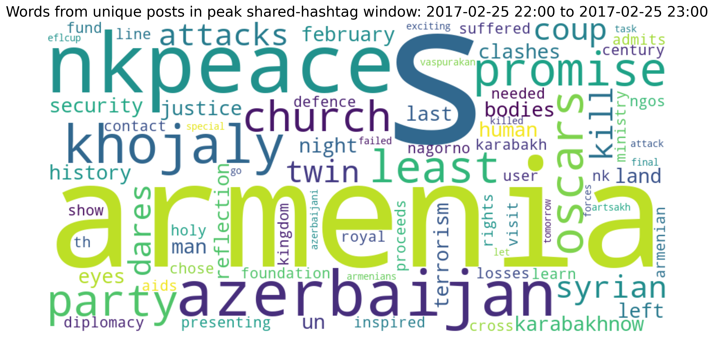

# Group shared-hashtag report

Window: **[2017-02-25 22:00:00, 2017-02-25 23:00:00)** (start inclusive, end exclusive; h).
Scope: all selected-group posts in the highest-sharing window.

## Authors

- IO authors in selected group: **1 / 40 (2.5%)**.
- IO authors among active group authors: **0 / 7 (0.0%)**.

## Posts

- Total post rows: **12**.
- Unique post IDs: **12** (missing IDs: 0).
- Unique nonempty texts (translated_post): **9**.
- Reposts: **6**.
- Original posts (explicitly not reposts): **6**.
- Unknown repost status: **0**.

## Reposted messages

Messages are grouped by source post ID, falling back to exact text with whitespace normalized when the ID is missing. Publication times are looked up across the full input data, including outside the group. Unknown means the source ID or its timestamp is unavailable.

1. Source ID: c4dfeb6979c67fbae08052e10ab03024019a57591e. **Original published in window: Unknown.** <code>bodies left no-man&#x27;s land last night&#x27;s clashes nagorno-karabakh. diplomacy needed!</code>
2. Source ID: 6c39ebe91a2f75bcdf87e36c5cbe151177d29058b7. **Original published in window: Unknown.** <code>inspired. &lt;user&gt; presenting promise oscars party. proceeds fund aids foundation, ngos &lt;url&gt; &lt;url&gt;</code>
3. Source ID: 6c879e7ba42c6a1307b50b25d64560b50f11e554ee. **Original published in window: Unknown.** <code>learn user chose show promise oscars party:</code>
4. Source ID: 4958f6bf1957e95e50e0d169139a2a00100a06ab28. **Original published in window: Unknown.** <code>ministry defence azerbaijan admits suffered losses nk &lt;url&gt; nkpeace &lt;url&gt;&#x27;s contact line</code>
5. Source ID: 9147cb4afc83786163b8ed36b9a1de79f2280b5cbc. **Original published in window: Unknown.** <code>🔴 🔴 exciting task tomorrow! let&#x27;s go &lt;user&gt; ! eflcup final &lt;url&gt;</code>
6. Source ID: 31aacc9022763af7c741140c1e8d69c476e5b4b45d. **Original published in window: Unknown.** <code>least 5 azerbaijani special forces killed failed attack armenians artsakh.</code>

## Repost counts by account

Rows match the numbered messages above; columns include every active group account. Values count repost rows (including repeated reposts).

| message_number   | 1eca42bcd9d39359ed112ab7b1170b88ca7609a321   | 295ae5b2dcc57858331146d2a991d2f2037f703981   | 3c82c1390a4bec6165733c6fd2cc5a08872734c642   | 4b47e0358f151ae91d4efb52d9acf7c4bba20d8d56   | 5c7925f602de5ad67153cf718f3b5ef9f63efef170   | 643eaafa9f7350392152660af5aa7e6ebbbed6599b   | 9e622b8318775391537338cdaf55f7c3112098a3fc   |
|:-----------------|:---------------------------------------------|:---------------------------------------------|:---------------------------------------------|:---------------------------------------------|:---------------------------------------------|:---------------------------------------------|:---------------------------------------------|
| 1                | 0                                            | 0                                            | 1                                            | 0                                            | 0                                            | 0                                            | 0                                            |
| 2                | 0                                            | 0                                            | 1                                            | 0                                            | 0                                            | 0                                            | 0                                            |
| 3                | 0                                            | 0                                            | 1                                            | 0                                            | 0                                            | 0                                            | 0                                            |
| 4                | 0                                            | 0                                            | 1                                            | 0                                            | 0                                            | 0                                            | 0                                            |
| 5                | 1                                            | 0                                            | 0                                            | 0                                            | 0                                            | 0                                            | 0                                            |
| 6                | 1                                            | 0                                            | 0                                            | 0                                            | 0                                            | 0                                            | 0                                            |

## Unique-post word cloud

Each distinct nonempty text contributes once, with whitespace normalized. URLs, mentions, hashtags, stopwords, and non-ASCII letters are removed.

