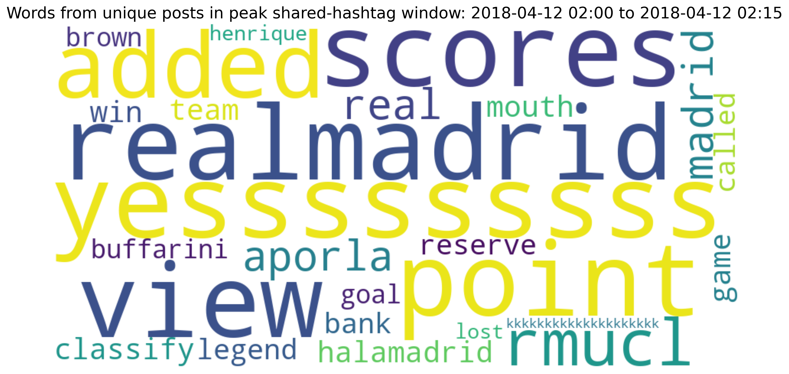

# Group shared-hashtag report

Window: **[2018-04-12 02:00:00, 2018-04-12 02:15:00)** (start inclusive, end exclusive; 15min).
Scope: all selected-group posts in the highest-sharing window.

## Authors

- IO authors in selected group: **293 / 322 (91.0%)**.
- IO authors among active group authors: **293 / 294 (99.7%)**.

## Posts

- Total post rows: **296**.
- Unique post IDs: **296** (missing IDs: 0).
- Unique nonempty texts (translated_post): **4**.
- Reposts: **0**.
- Original posts (explicitly not reposts): **296**.
- Unknown repost status: **0**.

## Reposted messages

Messages are grouped by source post ID, falling back to exact text with whitespace normalized when the ID is missing. Publication times are looked up across the full input data, including outside the group. Unknown means the source ID or its timestamp is unavailable.

No reposts in this window.

## Repost counts by account

Rows match the numbered messages above; columns include every active group account. Values count repost rows (including repeated reposts).

No repost counts to display.

## Unique-post word cloud

Each distinct nonempty text contributes once, with whitespace normalized. URLs, mentions, hashtags, stopwords, and non-ASCII letters are removed.

