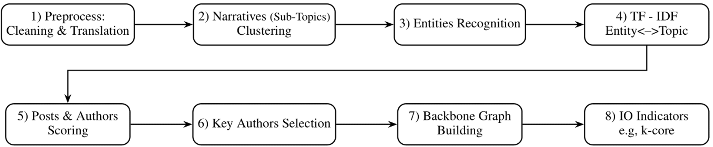

## Workflow

This folder (`Backbone-Graph/src`) contains the code for this workflow.

## Working Directory

Working directory assumption (matches the notebooks): run from `Backbone-Graph/src`.

## Notebook order (pipeline)

### 1. `translate_and_clustering.ipynb`

  - pre-prosses
  - NER
  - topic modeling (for data up to 100k posts).  
      If the dataset is too large foir the clustering (OOM error), use `big_data_clustering.ipynb` for the topic modeling (pre-prosses, NER are stiil preformed by `translate_and_clustering.ipynb`).

### 2. `key_authors_graph.ipynb`
  - key autros selection
  - Backbone graph bulding
  - IO indicators

### Not part of the pipeline

- `Boost.ipynb` is **excluded** (not part of the ordered workflow).

## Notebook details

### 1) `translate_and_clustering.ipynb`

**Inputs**
- Path to Dataset parquet with the secma like https://zenodo.org/records/14189193
- `min_topic_size` (used for BERTopic and naming the output folder)

**What it does**
- Loads the parquet and performs dataset preparation.
- Translates text (when needed).
- Runs NER and stores enriched columns in the dataframe.
- Builds embeddings and performs topic clustering (BERTopic; plus additional clustering/evaluation utilities inside the notebook).
- Writes progress logs during execution.

**Outputs**
- Output root (current behavior):

  - `../final_results/<dataset_name>/<file_name_no_suffixes>/BERT_min_topic_size_<min_topic_size>/`
- Typical artifacts created there:

  - `processed_<file_name>` (gzip parquet)
  - `dataset_summary.txt`
  - `progress_report.txt`
  - `topics_top_posts.parquet`
  - `BERTopic_model/` (saved model directory)
  - Topic plots (PNG) such as BERTopic topic distribution / accounts distribution

> Note: Some downstream steps (like `key_authors_graph.ipynb`) currently read from `../results/...`, not `../final_results/...`.
> If you run `translate_and_clustering.ipynb` and want to continue to `key_authors_graph.ipynb`, either:
> - adjust `key_authors_graph.ipynb` to read from `../final_results/...`, or
> - copy the produced `processed_<file_name>` into the `../results/<dataset_folder>/<file_name_no_suffixes>/<date>/` layout that `key_authors_graph.ipynb` expects.

---

### 1b) `big_data_clustering.ipynb` (for huge datasets)

This notebook is intended for **large-scale topic clustering** (chunked BERTopic + merge).

**Inputs**
- A **preprocessed parquet** that already contains the translated / NER-enriched content required for clustering.
- Current expected input location (as coded in the notebook):

  - `../results/<dataset_name>/<raw_file_name_no_suffixes>/<date>/Topic_Ner_<raw_file_name>`
- Parameters in the notebook:

  - `dataset_name` (example: `Labeled_Datasets/Ecuador`)
  - `raw_file_name` (example: `Ecuador_part_all.gzip.parquet`)
  - `date` (example: `2026_01_10`)
  - `min_topic_size` (passed by SLURM script; also used in output folder names)
  - `chunk_size` (controls how many documents per BERTopic chunk)

**What it does**
- Loads the preprocessed dataset.
- Trains BERTopic in chunks and merges the chunk models.
- Adds topic labels back into the dataframe.
- Generates topic statistics and plots (post counts per topic, unique accounts per topic).
- Saves progress reports during long runs.

**Outputs**
- Output root (current behavior):

  - `../results/<dataset_name>/<raw_file_name_no_suffixes>/<date>/`
- Typical artifacts created there:

  - `processed_<raw_file_name_no_suffixes>.gzip.parquet`
  - `progress_reports/progress_report_min_topic_size_<min_topic_size>.txt`
  - `BERTopic_models_min_topic_size_<min_topic_size>/` (chunk models + merged model)
  - Plots (PNG) like `<topic_col>_topic_clustering.png` and `<topic_col>_topic_accounts.png`

---

### 2) `key_authors_graph.ipynb`

This notebook builds the **accounts information-flow graph** for the chosen topic column and exports it to GEXF.

**Inputs**
- A processed parquet (with topic labels) at:

  - `../results/<dataset_folder>/<file_name_no_suffixes>/<dataset_procced_date>/processed_<file_name>`
- Parameters in the notebook:

  - `dataset_folder` (example: `Labeled_Datasets/Ecuador`)
  - `file_name` (example: `Ecuador_part_all.gzip.parquet`)
  - `dataset_procced_date` (example: `2026_01_10`)
  - `topic_col` (example: `BERTopic_topic_512`)
  - `top_n` (example: `300`; top authors per topic)
- The processed dataframe is expected to contain:

  - An account identifier (default: `accountid`)
  - The chosen `topic_col`
  - Interaction columns used to build edges (e.g., replies/mentions/reposts; see notebook)

**What it does**
- Computes author-topic TF-IDF and identifies “key authors” per topic.
- Produces IO / influence summaries.
- Builds a directed accounts graph and exports it for visualization (Gephi).

**Outputs** (written to the same folder as the processed parquet)
- `author_topic_tfidf_by_<topic_col>.parquet`
- `io_key_authors_summary.txt`
- `<topic_col>_accounts_graph.gexf`
- `<topic_col>_accounts_graph_spring.png`
- Additional indicators/plots/parquets (information gain, comparisons, etc.) depending on the run.

## Batch execution (SLURM)

The repo contains papermill-based SLURM scripts:
- Translate + clustering:

  - `sbatch ../config/run_translate_and_clustering.sbatch <DATASET_FILE_NAME>`
  - Script: `../config/run_translate_and_clustering.sbatch`
  - Note: it passes only `file_name`; `dataset_name` and other parameters remain as set inside the notebook.
- Big data clustering:

  - `sbatch ../config/run_big_data_clustering.sbatch <MIN_TOPIC_SIZE>`
  - Script: `../config/run_big_data_clustering.sbatch`

See `../config/slurm_commends.md` for examples.

